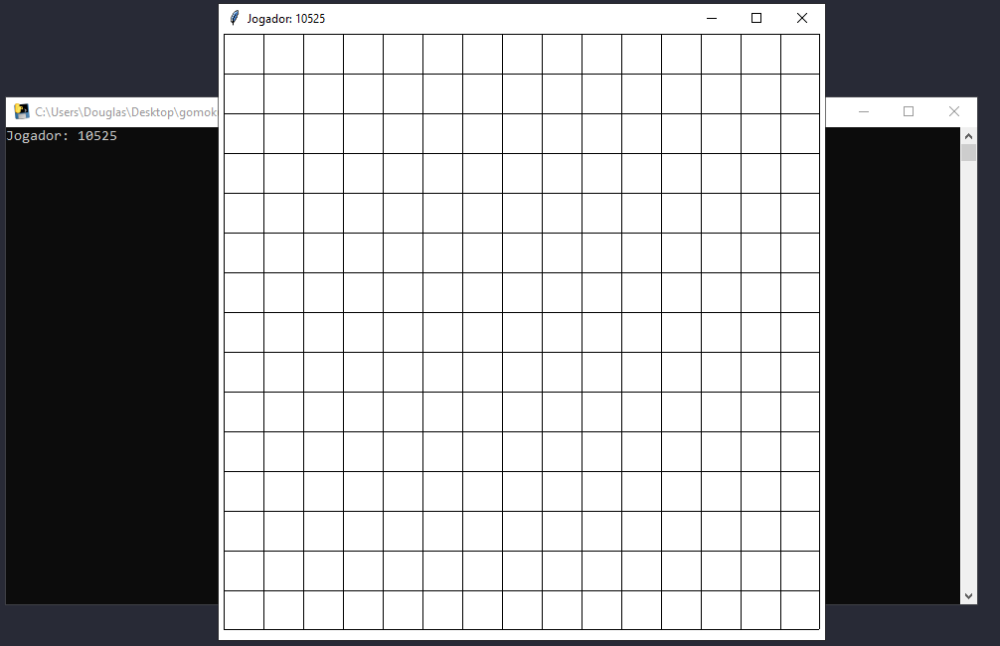
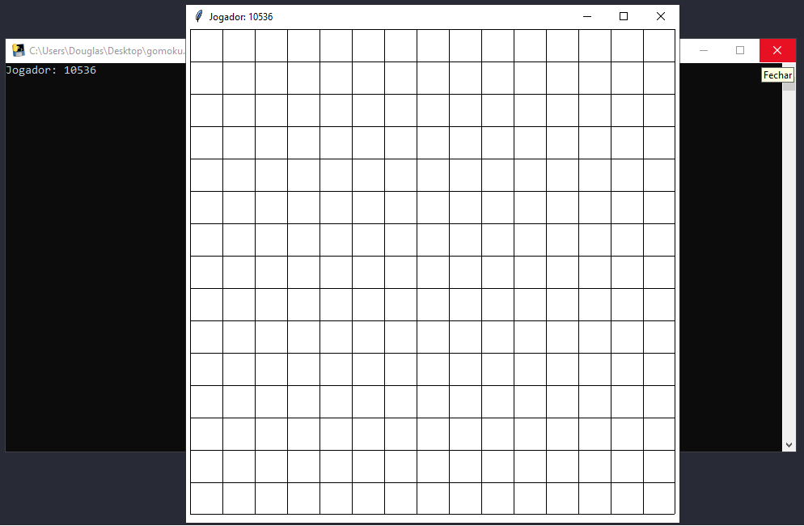
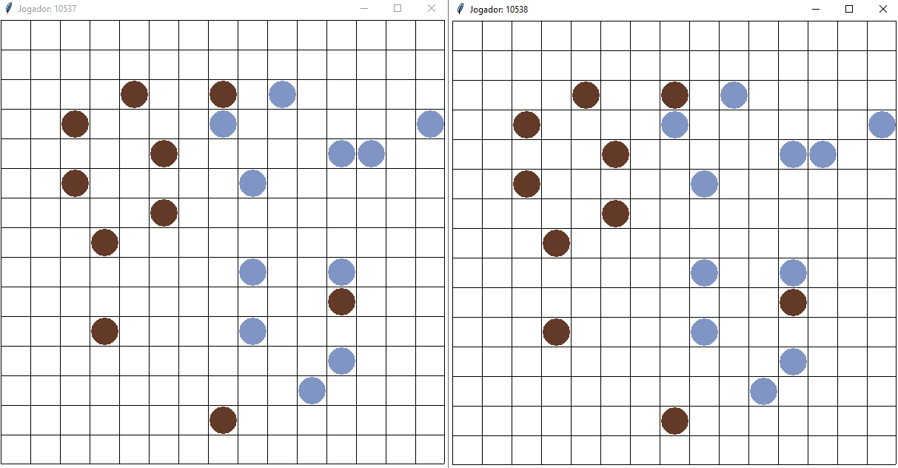
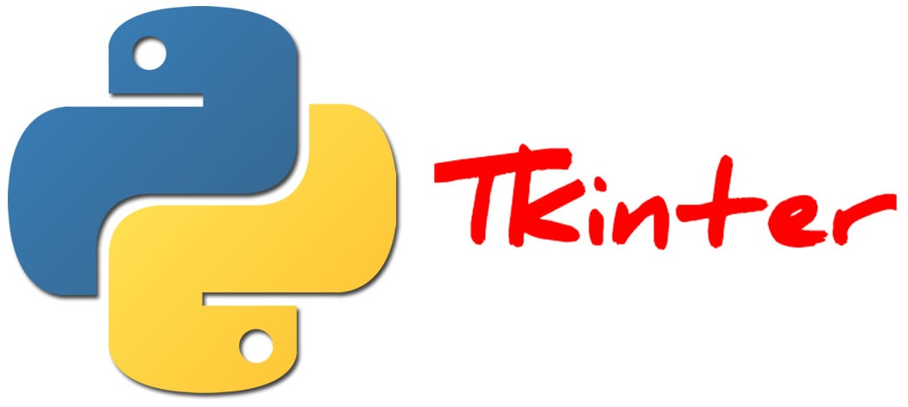

# Gomoku Game Front-End

The objective of this project is to implement the game [Gomoku](https://en.wikipedia.org/wiki/Gomoku) using Sockets. 

### Considerations
- If you want to try this game I have made an executable so you don't have to do any work but you have to open the port **6969** on your firewall, or change the **PORT** variable on [Config](src/Config/__init__.py).
- This currently implementation is hosted on localhost, if you want to play across the internet, just run the [backend](https://github.com/douglasJovenil/gomoku-game-frontend) on some cloud machine and change the **HOST** variable on [Config](src/Config/__init__.py).
- This version supports just two players at same time.
- To run this application you have to run the [backend](https://github.com/douglasJovenil/gomoku-game-frontend) too.

## ☁️ Links

- [Game executable](https://github.com/douglasJovenil/gomoku-game-frontend/releases/download/v1.0/gomoku.exe)
- [Back-end code](https://github.com/douglasJovenil/gomoku-game-backend)

## 💻 Project

### Player A in the room



### Player B in the room



### In game




## 🚀 Technologies

This project was developed with the following technologies:

 Python3.7+

 Sockets

 Tkinter


## 🏃 Usage

```bash
pip install -r requirements.txt
git clone https://github.com/douglasJovenil/gomoku-game-frontend
cd gomoku-game-frontend
python main.py
```

### To generate an executable

```
cd gomoku-game-frontend
pyinstaller --onefile src/main.py
```

The executable in be on folder **dist**.